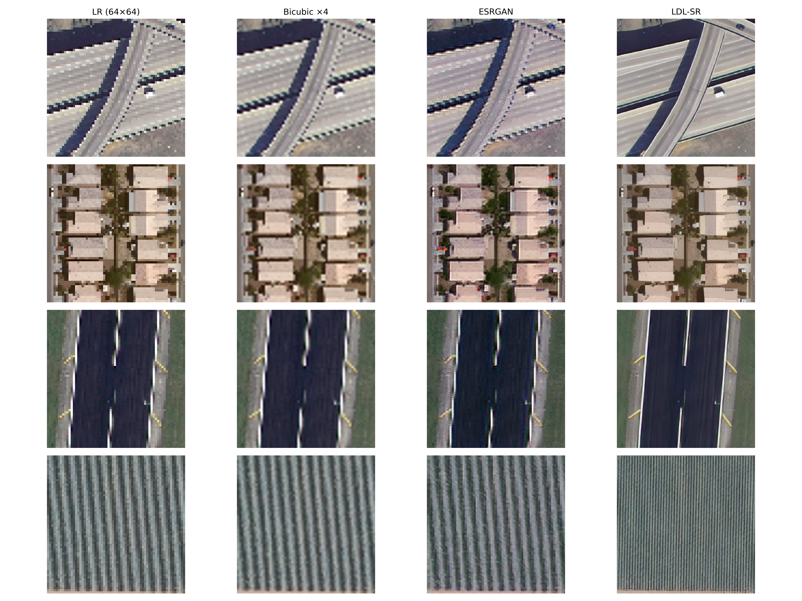
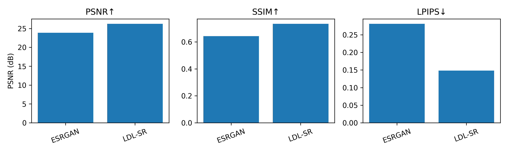
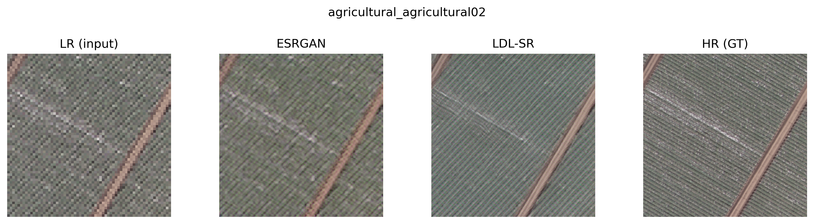
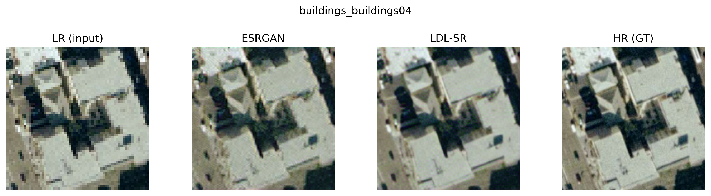
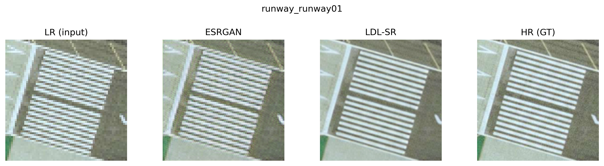

# LDL-SR on UC Merced: Artifact-Aware Remote-Sensing Super-Resolution

## Overview
This project applies Locally Discriminative Learning (LDL) to remote-sensing image super-resolution using the UC Merced Land Use dataset.

The implementation builds upon the original LDL and ESRGAN frameworks and adapts them to a structured aerial imagery domain. The goal is to reduce hallucinated high-frequency artifacts while preserving geometric fidelity.

---

## Contribution
This project focuses on adaptation and evaluation rather than proposing a new model.

Main contributions:
- Applied LDL to the UC Merced dataset
- Built a full training and evaluation pipeline
- Compared ESRGAN and LDL under consistent settings
- Conducted both quantitative and qualitative analysis

---

## Repository Structure

- Code/
  - basicsr/
  - options/
    - train/
    - test/
  - LDL_SR_Training.ipynb
  - Result&Experiments.ipynb

- results/
  - compare_agricultural_agricultural02.png
  - compare_buildings_buildings04.png
  - compare_runway_runway01.png
  - Table1_UCMerced_ESRGAN_vs_LDL.csv
  - UCMerced_ESRGAN_vs_LDL_metrics.png
  - UCMerced_qualitative_grid.png

- Paper/
- README.md

---

## Method

The project uses ESRGAN as the baseline and integrates LDL to guide artifact-aware learning.

Key idea:
- Compute residual between ground truth and prediction
- Identify unstable regions using variance
- Use EMA model as a stable reference
- Apply targeted loss on artifact-prone areas

Loss formulation:
L_total = L_GAN + β * L_artifact

---

## Dataset

UC Merced Land Use Dataset:
- 2,100 RGB images
- 21 scene classes
- Image size: 256×256

Preprocessing:
- Downsample ×4 (to 64×64)
- Train/validation/test split: 70/15/15
- Random patch cropping (128×128)
- Data augmentation (flip, rotation, color jitter)

---

## Results

### Quantitative Comparison

| Model   | PSNR | SSIM | LPIPS |
|--------|------|------|------|
| ESRGAN | 21.95 | 0.565 | 0.360 |
| LDL-SR | 26.18 | 0.741 | 0.212 |

Detailed results are available in:
- results/Table1_UCMerced_ESRGAN_vs_LDL.csv

---

### Qualitative Comparison

---

### Metrics Visualization

---

### Sample Comparisons

Agricultural:

Buildings:

Runway:

---

## How to Run

1. Navigate to the Code folder:
cd Code

2. Install dependencies:
pip install -r requirements.txt

3. Run training:
jupyter notebook LDL_SR_Training.ipynb

4. Run experiments:
jupyter notebook Result&Experiments.ipynb

---

## Notes

- This repository includes only essential files and selected results.
- Large datasets, intermediate outputs, and pretrained models are not included due to size constraints.
- The implementation is based on the original LDL and ESRGAN codebases.

---

## Paper

The full paper is available in the `Paper/` folder.

---

## Author

Sarah Wai  
MSc Computer Science  
University of Regina

---

## License

MIT License
